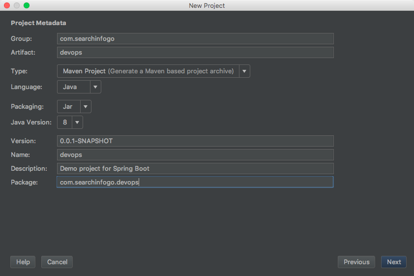
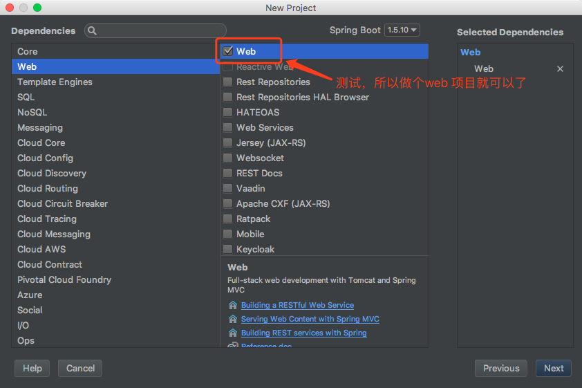
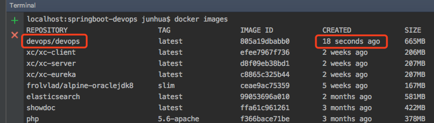
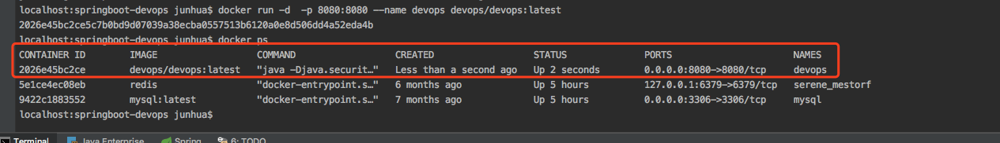

> 知之愈明,则行之愈笃；行之愈笃,则知之益明.——朱熹（宋）

我们在平常学习了很多的知识，但是如果没有深入去实践，知识掌握就不会牢固，所以需要通过实践来巩固。现在大多数的业务都切换到了Spring Boot，更加复杂和庞大的业务则使用Spring Cloud，当然也有用Dubbo，所以准备在Spring Boot中集成Docker，进行服务化。 <!-- more -->

### 创建项目进行集成
创建一个Spring Boot 项目





### 增加项目对Docker的支持
1. 修改pom.xml配置，增加对应的插件，可以使用Maven进行打包
``` bash
#Docker 镜像前缀，放在<properties> 标签中
 <docker.image.prefix>devops</docker.image.prefix>
```
2. 添加视图模板支持
``` xml
<dependency>
			<groupId>org.springframework.boot</groupId>
			<artifactId>spring-boot-starter-thymeleaf</artifactId>
</dependency>
```

3. 增加对应的maven 插件，插件有多种，这里采用 <groupId>com.spotify</groupId>
``` xml
<build>
  <finalName>devops</finalName>  
  <plugins>
    <plugin>
      <groupId>org.springframework.boot</groupId>  
      <artifactId>spring-boot-maven-plugin</artifactId>
    </plugin>  
    <!-- docker打包 -->  
    <plugin>
      <groupId>com.spotify</groupId>  
      <artifactId>docker-maven-plugin</artifactId>  
      <version>1.0.0</version>  
      <configuration>
        <serverId>docker-hosted</serverId>  
        <!-- docker仓库地址，用于推送镜像 -->  
        <registryUrl>${docker.repository}</registryUrl>
        <!-- 设置为false，避免自动推送镜像 -->
        <pushImage>false</pushImage>  
        <!-- Dockerfile路径 -->  
        <dockerDirectory>src/main/docker</dockerDirectory>  
        <!-- 构建的镜像名称 -->  
        <imageName>${docker.image.prefix}/${project.artifactId}</imageName>  
        <imageTags>
          <imageTag>latest</imageTag>
        </imageTags>  
        <resources>
          <resource>
            <targetPath>/</targetPath>  
            <directory>${project.build.directory}</directory>  
            <include>${project.build.finalName}.jar</include>
          </resource>
        </resources>
      </configuration>
    </plugin>
  </plugins>
</build>
```

4. 修改Maven settings 文件配置（主要的目的是为了方便后面我们将自己的服务推送到自己的私服，方便管理）
``` xml
<pluginGroups>
  <pluginGroup>com.spotify</pluginGroup>
</pluginGroups>

#本地私服的配置
</profiles>
 <profile>    
   <id>nexus</id>    
   <properties>
   <docker.repository>http://192.168.100.77:8081/repository/docker</docker.repository>
   </properties>
 </profile>
</profiles>
#激活私服配置
<activeProfiles>    
  <activeProfile>nexus</activeProfile>    
</activeProfiles>
```

上面基本的pom配置就完成了，之后开始配置Docker相关的脚本

### Docker脚本配置
在src/main 目录下创建docker 文件夹，刚刚上面的pom配置里声明了Dockerfile的路径
创建文件Dockerfile ，注意文件没有后缀，之后增加如下脚本
``` shell
FROM java:8  #基本镜像
VOLUME /tmp  #挂载文件位置，/tmp 为临时目录
ADD devops.jar app.jar  #添加对应的jar，使用maven打包后会自动到target目录找devops.jar 文件
ENTRYPOINT ["java","-Djava.security.egd=file:/dev/./urandom","-jar","/app.jar"] # 程序启动入口
```

### 打包、运行镜像
创建对应的测试文件，打包
``` shell
mvn clean package docker:build  # 一气呵成O(∩_∩)O~~
```
在运行docker命令前，先确认电脑上的docker环境是否配置成
``` shell
docker version
# 会有如下显示
Client:
 Version:	17.12.0-ce
 API version:	1.35
 Go version:	go1.9.2
 Git commit:	c97c6d6
 Built:	Wed Dec 27 20:03:51 2017
 OS/Arch:	darwin/amd64

Server:
 Engine:
  Version:	17.12.0-ce
  API version:	1.35 (minimum version 1.12)
  Go version:	go1.9.2
  Git commit:	c97c6d6
  Built:	Wed Dec 27 20:12:29 2017
  OS/Arch:	linux/amd64
  Experimental:	true
```
上面说明Docker是正常启动的

然后查看镜像
``` shell
docker images
```

上图说明我们的镜像打包成功
然后运行一下，检查镜像是否能够正常启动
``` shell
#启动镜像 -d 表示后台运行，-p 端口进行映射 --name docker服务名称  devops/devops:latest 运行的镜像
docker run -d  -p 8080:8080 --name devops devops/devops:latest
#执行docker ps 查看镜像是否运行
```

如果，说明服务是正常启动了，之后请求
[http://localhost:8080/index?name=World](http://localhost:8080/index?name=World)

能够请求成功，说明镜像部署成功

### 停止释放镜像
``` shell
# 养成好习惯，停止释放镜像
docker stop 2026e45bc2ce
docker rm 2026e45bc2ce
```

代码可在[https://github.com/junhuali/devops-springboot](https://github.com/junhuali/devops-springboot) 下载
