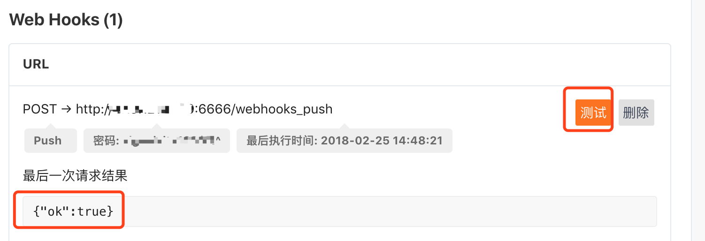
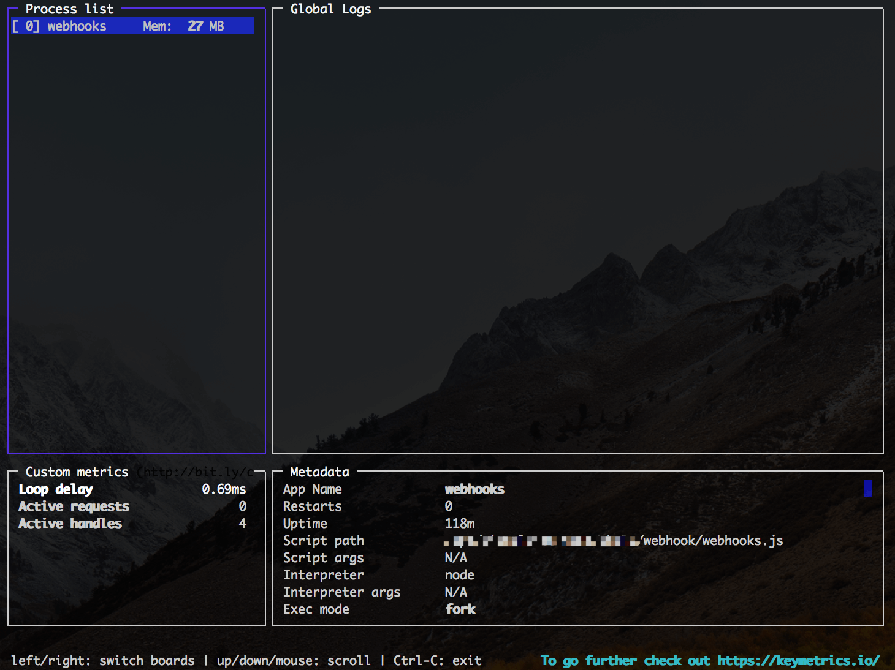

### 原因
我们经常使用GitHub、GitLab、Gitee 之类的仓库，有时候需要频繁的发布代码打包，人工发布，工作量有时候会很大，有时候还容易出错，所以会使用Jenkins一类的工具进行辅助，但是如果是一个简单的项目或者是一个个人的项目使用Jenkins就显得太重了，可以直接使用webhook，比较方便。
### 什么是webhook
>准确的说webhoo是一种web回调或者http的push API，是向APP或者其他应用提供实时信息的一种方式。Webhook在数据产生时立即发送数据，也就是你能实时收到数据。这一种不同于典型的API，需要用了实时性需要足够快的轮询。这无论是对生产还是对消费者都是高效的，唯一的缺点是初始建立困难。

>Webhook有时也被称为反向API，因为他提供了API规则，你需要设计要使用的API。Webhook将向你的应用发起http请求，典型的是post请求，应用程序由请求驱动。

### 配置webhook
知道什么是webhook 后我们就要开始配置我们自己的项目了。
环境：
   CentOS7
   Gitee（网上GitHub的教程比较多，这个基于码云）
- 配置项目公私钥
1. 生产公钥
``` bash
ssh-keygen -t rsa -C "xxxxx@xxxxx.com"  

# Generating public/private rsa key pair...
# 三次回车即可生成 ssh key
```
2. 查看公钥
``` bash
cat ~/.ssh/id_rsa.pub
# ssh-rsa AAAAB3NzaC1yc2EAAAADAQABAAABAQC6eNtGpNGwstc....
```
3. 添加公钥

4. 测试
``` bash
ssh -T git@gitee.com
Welcome to Gitee.com, yourname! # 返回，说明正常
```

- 配置服务器node环境
1. 安装nvm，服务器上使用nvm 方便多版本node切换
``` bash
curl -o- https://raw.githubusercontent.com/creationix/nvm/v0.33.8/install.sh | bash
vim /etc/profile
#加入下面的内容
export NVM_DIR="$HOME/.nvm"
[ -s "$NVM_DIR/nvm.sh" ] && \. "$NVM_DIR/nvm.sh"
source /etc/profile
nvm install stable # 安装稳定版
nvm current # 查看当前的版本
```
2. 配置相关的脚本
安装gitee-webhook-handler(GitHub,GitLab,gitee 的包是不同的，不能混用)
``` bash
mkdir /opt/webhook #创建目录
cd /opt/webhook
npm install -g gitee-webhook-handler # 当前的版本为v0.1.2
```
3. 创建对应的webhook服务
``` bash
vim webhook.js

var http = require('http')
var createHandler = require('gitee-webhook-handler')
var handler = createHandler({ path: '/webhooks_push', secret: '123456' })# post 所需要用到的秘钥

function run_cmd(cmd, args, callback) {
  var spawn = require('child_process').spawn;
  var child = spawn(cmd, args);
  var resp = "";
  child.stdout.on('data', function(buffer) { resp += buffer.toString(); });
  child.stdout.on('end', function() { callback (resp) });
}
handler.on('error', function (err) {
  console.error('Error:', err.message)
})
handler.on('Push Hook', function (event) {  # 这个地方就是GitHub 和 Gitee 不一样的地方，需要注意
  console.log('Received a push event for %s to %s',
    event.payload.repository.name,
    event.payload.ref);
    run_cmd('sh', ['./deploy.sh'], function(text){ console.log(text) });# 需要执行的脚本位置
})
try {
  http.createServer(function (req, res) {
    handler(req, res, function (err) {
      res.statusCode = 404
      res.end('no such location')
    })
  }).listen(6666) # 服务监听的端口，可以自行修改
}catch(err){
  console.error('Error:', err.message)
}
```
4. 创建需要执行的脚本
``` bash
vim deploy.sh
git pull xxxxx  # 根据自己的需要自行编写
```
5. 测试服务


显示ok，说明成功

### 使用pm2应用进程管理器
使用node 启动服务不是很方便，推荐使用pm2
``` bash
npm install -g pm2
pm2 start webhook.js
pm2 monit # 可以通过此命令查看服务的状态
```

上图显示了一些应用的基本信息，可以更好的观察到服务的状态

### 结束
配置完成后，只要pull代码到仓库，就会触发webhook执行脚本，十分的方便，同时减少了工作量，相对采用轮询的方式消耗的资源更小。


参考：https://www.npmjs.com/package/gitee-webhook-handler
