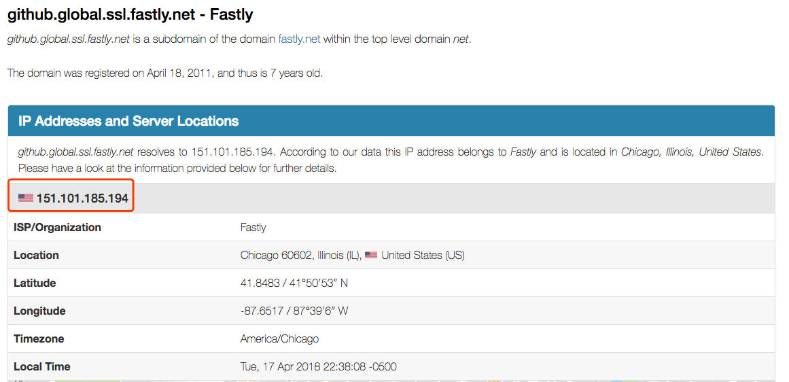
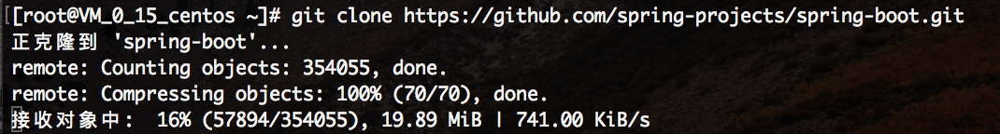
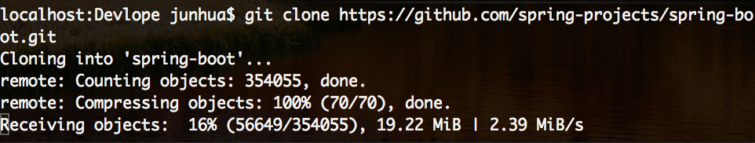

### Github 速度慢
众所周知的原因，国内的vps 从Github 上clone 源码的速度感人。于是查了一下，发现有两种方法可以提升从GitHub clone 代码的速度。<!-- more -->

### 修改hosts
从`http://github.global.ssl.fastly.net.ipaddress.com/` 可以获取到速度比较快的ip，通过替换hosts ，达到加速的目的。


``` Shell
vim /etc/hosts
# GitHub Start
151.101.185.194 github.global.ssl.fastly.net
```
保存后自动生效


通过下载Spring Boot 的源码，见上图，速度还不错。

### 通过代理提升本地的速度
一般我们都是使用ss的本地socks5代理，速度多快，取决于提供服务的vps的速度。
``` Shell
git config --global --unset http.proxy
git config --global --unset https.proxy
git config --global http.proxy 'socks5://127.0.0.1:1080'
git config --global https.proxy 'socks5://127.0.0.1:1080'
```


上面的配置需要注意自己的socks5 端口，Mac 和 Windows的一般是1080，Mac的根据自己设置的进行修改，比如我的是1086，所以需要改成`socks5://127.0.0.1:1086`。

通过上面的两个方法，可以大幅提升服务器和本地的GitHub代码clone 速度，解决漫长的等待，特别是比较大的仓库。
