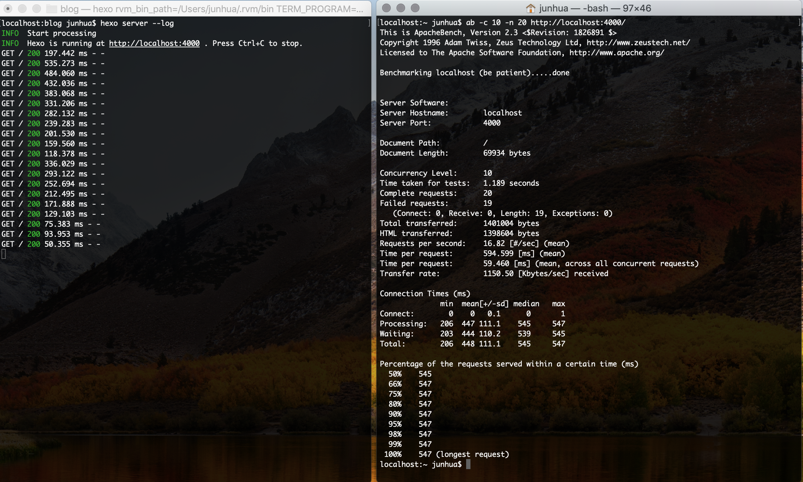

在我们开发的过程中，我们难免需要对我们的接口进行压测，这样上线以后才更有信心。常用的性能测试工具：ab、Jmeter、Postman、阿里云PTS等。<!--More-->

### 安装
#### CentOS7 下安装ad

``` shell
yum -y install httpd-tools
```

然后使用百度做个测试
``` shell
[root@VM_0_15_centos ~]#  ab -n 1000 -c 10 https://www.baidu.com/
This is ApacheBench, Version 2.3 <$Revision: 1430300 $>
Copyright 1996 Adam Twiss, Zeus Technology Ltd, http://www.zeustech.net/
Licensed to The Apache Software Foundation, http://www.apache.org/

Benchmarking www.baidu.com (be patient)
Completed 100 requests
Completed 200 requests
Completed 300 requests
Completed 400 requests
Completed 500 requests
Completed 600 requests
Completed 700 requests
Completed 800 requests
Completed 900 requests
Completed 1000 requests
Finished 1000 requests


Server Software:        BWS/1.1
Server Hostname:        www.baidu.com
Server Port:            443
SSL/TLS Protocol:       TLSv1.2,ECDHE-RSA-AES128-GCM-SHA256,2048,128

Document Path:          /
Document Length:        227 bytes

Concurrency Level:      10
Time taken for tests:   15.518 seconds
Complete requests:      1000
Failed requests:        0
Write errors:           0
Total transferred:      893000 bytes
HTML transferred:       227000 bytes
Requests per second:    64.44 [#/sec] (mean)
Time per request:       155.176 [ms] (mean)
Time per request:       15.518 [ms] (mean, across all concurrent requests)
Transfer rate:          56.20 [Kbytes/sec] received

Connection Times (ms)
              min  mean[+/-sd] median   max
Connect:      104  114   6.8    116     172
Processing:    35   39   5.1     39     140
Waiting:       35   38   5.1     39     140
Total:        139  153   9.8    156     264

Percentage of the requests served within a certain time (ms)
  50%    156
  66%    159
  75%    160
  80%    161
  90%    163
  95%    164
  98%    165
  99%    175
 100%    264 (longest request)
```
上面就是请求后的结果。注意请求的地址后面要加`/`否则会报无效的url。
#### Mac 上使用

Mac 上好像有自带的ab 工具，请求效果如下


### 使用Jmeter
具体可以查看[Jmeter](https://jmeter.apache.org/),后面会补充这一部分的内容

### 使用阿里云PTS
具体可参考[PTS](https://www.aliyun.com/product/pts)
